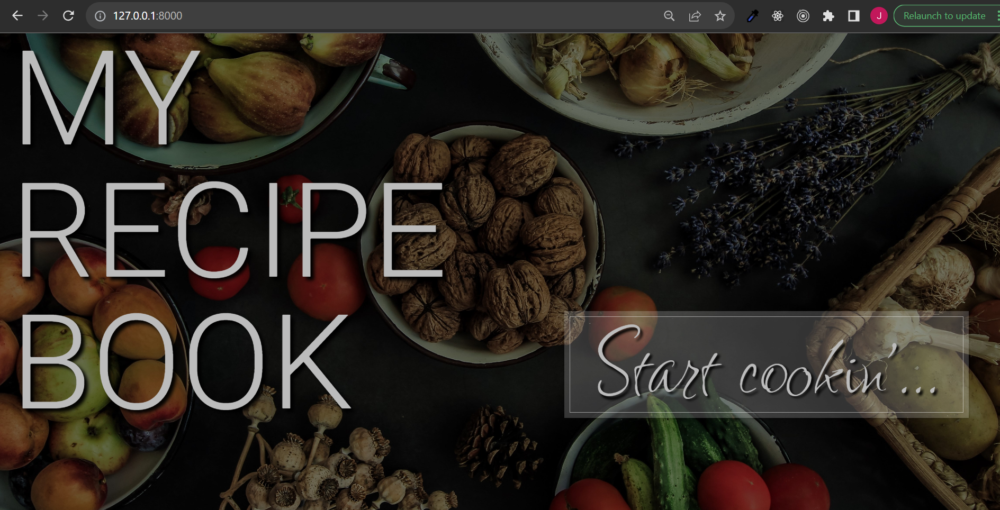

# cfPython_Achievement2
 
<details>
<summary><h2>Creating the Recipe App with Django</h2></summary>
 
While the [previous achievement](https://github.com/JBorchers/cfPython_Achievement1/tree/main) built a command-line version of a recipe app, this achievement will redevelop the app using the Django framework.

Django is a high-level Python web framework that simplifies the process of building web applications by providing a set of tools and conventions for various web development tasks. It follows the Model-View-Controller (MVC) architectural pattern, which Django refers to as Model-View-Template (MVT):

- Models (M): In Django, models are Python classes that define the structure of your database tables. Each model class represents a table, and its attributes represent the columns of the table. Models define the data structure and can include fields, relationships, and methods for data manipulation.

- Views (V): Views handle the presentation logic and interact with the user. In the context of Django, views are Python functions or classes that process HTTP requests and return HTTP responses. They decide what data to display and how it should be displayed.

- Templates (T): Templates provide the HTML structure for your web pages. They separate the presentation layer from the logic in views. Django's template engine allows you to insert dynamic data into your HTML templates.

</details>

<!--------------------------------------------------------------------------------------------------------------------------------------------->
<!--------------------------------------------------------------------------------------------------------------------------------------------->


<details>
<summary><h2>Backend Project Set Up</h2></summary>

## MODELS

Here we are working with the **M** part of Django's **MVT** architecture.
The app is composed of four main entities:

- `Users`
- `Recipes`
- `Ingredients`
- `RecipesIngredients`

_Users_ :<br>This app handles user authentication, registration, login, and profile management.<br><br>
_Recipes_ :<br>Each recipe is listed for the user, displaying recipe name, cooking time, level of difficulty, and ingredients.<br><br>
_Ingredients_ :<br>All ingredients are stored in this app amongst all recipes.<br><br>
_RecipesIngredients_ :<br>This app handles the many-to-many relationship between recipes and ingredients. This is where ingredients are added to a selected recipe to then be appended to the recipe itself and stored in the `ingredients` app.<br><br>


</details>

<!--------------------------------------------------------------------------------------------------------------------------------------------->
<!--------------------------------------------------------------------------------------------------------------------------------------------->


<details>
<summary><h2>Django Project Views and Templates</h2></summary>

In a Django project, "views" and "templates" are fundamental components that work together to handle the presentation logic and rendering of web pages. They are key elements of the Model-View-Controller (MVC) architectural pattern used in Django.

Views handle the application logic and process requests, while templates define the structure and presentation of the resulting web pages. Together, they enable Django to build dynamic and data-driven web applications.

The front-end of the **Recipes** application will be build using these views and templates.

### Create a `View`

Create a `view.py` file under the desired app. Specify a `recipes_home.html` template, that you will create in the next step. Be sure to include the proper imports.

```
# src > recipes > views.py
from django.shortcuts import render

# Create your views here.
def recipes_home(request):
    return render(request, "recipes/recipes_home.html")
```

### Create a `Template`

Create a `templates` folder under the same app (`recipes`) as the `views.py`. <br>
Create another folder of the same name, `recipes`. <br>
Create an HTML file to define the main page template. Call it `recipes_home.html`.
Design welcome page and save it. <br>

```
# src > recipes > templates > recipes_home.html
<!DOCTYPE html>
<html lang="en">
  <head>
    <meta charset="UTF-8" />
    <meta name="viewport" content="width=device-width, initial-scale=1.0" />
    <title>Recipes</title>
    <style>
      body {
        display: flex;
        flex-direction: column;
        align-items: center;
        justify-content: center;
        height: 100vh;
      }
    </style>
  </head>
  <body>
    <h1>Welcome to your personalized Recipes App!</h1>
    <h3>Let's get cookin!</h3>
    <ul>
      
      <li>
        <a href="/recipes/{{ recipe.id }}">{{ recipe.title }}</a>
      </li>
      
    </ul>
    <a href="/recipes/new">Add a new recipe</a>
  </body>
</html>
```

### Map view to URL

In order for the welcome page to appear when the site is first loaded, map the template to a `urls.py` file under the `recipes` app. <br>
Specify the `path` to connect the route corresponding to “http://127.0.0.1:8000/” with the view specified by `recipes/views.py`. <br>
Ensure the proper packages are imported.

```
# src > recipes > urls.py
from django.urls import path
from .views import recipes_home

app_name = "recipes"

urlpatterns = [
    path("", recipes_home, name="recipes_home"),
]
```

Next, register the view to the `urlpatterns` in the main project folder's `urls.py`.
```
# src > recipe_project > urls.py
from django.contrib import admin
from django.urls import path
from django.urls import include

urlpatterns = [
    path("admin/", admin.site.urls),
    path("", include("recipes.urls"))
]
```

### Run server

In the terminal, activate your virtual environment. Run the server by typing `python manage.py runserver`

### Load site in browser

Copy the link provided by running the server and paste it into the browser. The custom webpage should now be loaded.


</details>

<!--------------------------------------------------------------------------------------------------------------------------------------------->
<!--------------------------------------------------------------------------------------------------------------------------------------------->


<details>
<summary><h2>Django MVT revisited</h2></summary>

### 1.	Update models if needed
   - I haven’t made any huge updates to my models. I still have three separate models: recipes, ingredients, and recipeingredients. Though I know there is a way to add the third model into one of the others, I found that the separation made things more organized and easier to manage.<br>
   - A simple update I had made was automating the calc_difficulty field based on number of ingredients and cooking time. Previously I had not had the functionality in place and values had to be manually entered. I also created an option to add a description to each recipe. Both the difficulty and description are required fields, but if no values are added, they are auto-populated with “no description” or “N/A”. <br>


### 2.	Adding records
   - Collect the information/media that will be added to the database.
   - Make entries in the Django admin panel for several recipes.

_Recipe Entries_


### 3.	Develop a welcome page
   - Take inspiration from existing applications. See [Learning Journal](https://github.com/JBorchers/cfPython_Achievement2/blob/main/Exercise_2.5/learning_journal_2.5.pdf)

_Welcome page for 2.5_




### 3.	Generate a recipes list

_Recipe App Sub-Page_


### 5.	Add recipe details <br>

_Recipe 1 example_


_Recipe 2 example_


### 6.	Repeat if necessary


### 7.	Run tests

```
from django.test import TestCase
from .models import Recipe
from ingredients.models import Ingredient

class RecipeModelTestCase(TestCase):

    def setUp(self):
        # Set up test data
        self.ingredient = Ingredient.objects.create(name='Test Ingredient')
        self.recipe = Recipe.objects.create(
            name='Test Recipe',
            cooking_time=5,
            difficulty='Easy'
        )
        self.recipe.ingredients.add(self.ingredient)

    def test_recipe_has_ingredient(self):
        self.assertEqual(self.recipe.ingredients.count(), 1)
        self.assertEqual(self.recipe.ingredients.first(), self.ingredient)

    
    def test_get_absolute_url(self):
        self.recipe = Recipe.objects.create(
            name='Test Recipe',
            cooking_time=5,
            difficulty='Easy'
        )
        self.assertEqual(self.recipe.get_absolute_url(), "/list/2")
```

_Test Results:_ <br>


</details>

<!--------------------------------------------------------------------------------------------------------------------------------------------->
<!--------------------------------------------------------------------------------------------------------------------------------------------->


<details>
<summary><h2>User Authentication in Django</h2></summary>

### 1. Provide authentication
- create a login view - ensure you have the correct imports
```
src/recipe_project/views.py

from django.shortcuts import render, redirect
from django.contrib.auth import authenticate, login, logout
from django.contrib.auth.forms import AuthenticationForm
from django.contrib import messages

def login_view(request):
    form = AuthenticationForm(request, request.POST or None)
    if request.method == "POST":
        if form.is_valid():
            username = form.cleaned_data.get("username")
            password = form.cleaned_data.get("password")
            user = authenticate(username=username, password=password)
            if user is not None:
                login(request, user)
                messages.info(request, f"You are now logged in as {username}.")
                return redirect("recipes:recipes_list")
        else:
            # Add an error message to the form
            form.add_error(None, "Invalid username or password. Please try again.")
    
    return render(request, "auth/login.html", {"form": form})

```
- creat a login template
```
# src/templates/auth/login.html



<!DOCTYPE html>
<html lang="en">
<head>
    <meta charset="UTF-8">
    <meta name="viewport" content="width=device-width, initial-scale=1.0">
    <title>Login</title>
    <style>
    # add styles
    </style>
</head>
<body>
    <div class="login-container">
        <p class="login-title">Login</p>
        <form action="" method="post">
            
            
            <div class="error-message">
                <p class="error-text">Invalid username or password.<br>Please try again.</p>
            </div>
            
            <div class="input-container">
                <label for="username">Username:</label>
                <input type="text" id="username" name="username" required>
            </div>
            <div class="input-container">
                <label for="password">Password:</label>
                <input type="password" id="password" name="password" required>
            </div>
            <button type="submit" class="login-button">Login</button>
        </form>
    </div>
</body>
</html>
```
  
- register a view and map URL

```
# /src/recipe_project/urls.py

from .views import login_view

urlpatterns = [
    path("login/", login_view, name="login"),
]
```

- add a "login" button on homepage that directs user to authentication form

```
# src/recipes/templates/recipes/recipes_home.html

<body>
    <div class="container">
        <p class="title">Welcome to Your Recipe Book</p>
        <a href="" class="login-button">Login to start cookin'</a>
    </div>
</body>
```

- redirect user to "Recipes List" page after successful login

```
# src/recipe_project/views.py

if user is not None:
    login(request, user)
    messages.info(request, f"You are now logged in as {username}.")
    return redirect("recipes:recipes_list")

```


### 2. Protect views
- identify pages that should be protected via authentication (recipes list, recipe details, profile view)
- user should be redirected to login page if any of the other views are tried without prior authentication


### 3. Implement logout
- add logout button on each protected page
- create a view for a successful logout (success.html)
- add a login button on the success.html page


### 4. Run server 
- test user journey through the application


</details>

<!--------------------------------------------------------------------------------------------------------------------------------------------->
<!--------------------------------------------------------------------------------------------------------------------------------------------->
